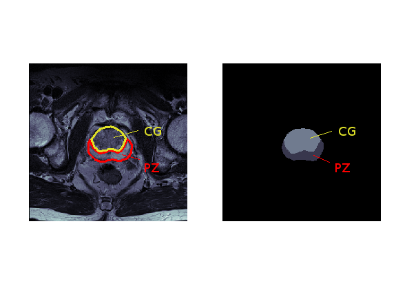
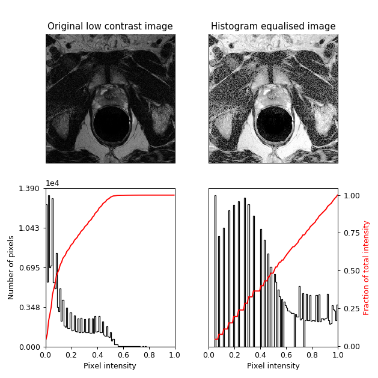
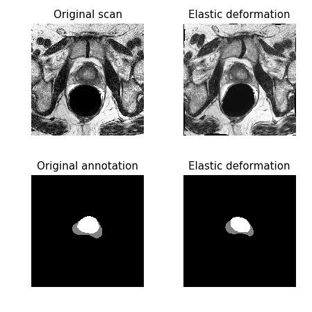
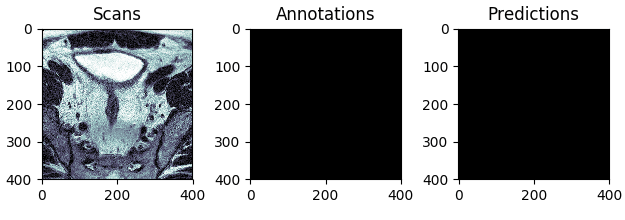
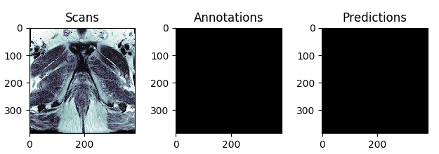

# 3D U-Net model for segmentation of prostate structures

In this project, I use the [3D U-Net](https://arxiv.org/pdf/1606.06650.pdf) model to segment prostate structures from the [NCI-ISBI 2013 challenge dataset](https://wiki.cancerimagingarchive.net/display/Public/NCI-ISBI+2013+Challenge+-+Automated+Segmentation+of+Prostate+Structures). Given a 3D MRI scan, the aim is to automatically annotate the peripheral zone (PZ) and central gland (CG) regions, as shown in Figure 1. 

*Figure 1:* Segmentation of prostate structures: MRI scan (left) and its annotation (right), where the peripheral zone (PZ) is coloured *dark gray*, central gland (CG) *bright gray*, and the background *black*. 

## Dataset

| | # 3D scans | Total # scan slices |
| :--- |  :---:  |  :---:  |
| Training set | 60 | 1544 |
| Validation set | 10 | 261 |
| Test set | 10 | 271 |

## Data pre-processing

In the pre-processing stage, I performed histogram equalisation on the input MR images, in order to increase image contrast. As shown in Figure 2, this technique redistributes pixel intensity values to achieve linear cumulative distribution function.

*Figure 2:* Example of the employed histogram equalisation.

## Data augmentation

Following the 3D U-Net paper, besides random rotations, scalings, and gray value variations, I also performed a smooth dense deformation field augmentation (also known as elastic distortion/transformation). The same random deformation was applied to a voxel tile and its annotation, as shown in Figure 3. 

All data augmentations were performed in the pre-processing stage as it allowed faster training, although at the expense of higher memory requirements (when compared to the augmentation on-the-fly).

*Figure 3:* Example of elastic deformation used for data augmentation.

## Results

The best and the worst predictions are shown in Figures 4 and 5 respectively. 

*Figure 4:* The test scan with the highest score (in terms of Intersection Over Union), i.e. the **best** prediction. 

*Figure 5:* The test scan with the lowest score (in terms of Intersection Over Union), i.e. the **worst** prediction. 
